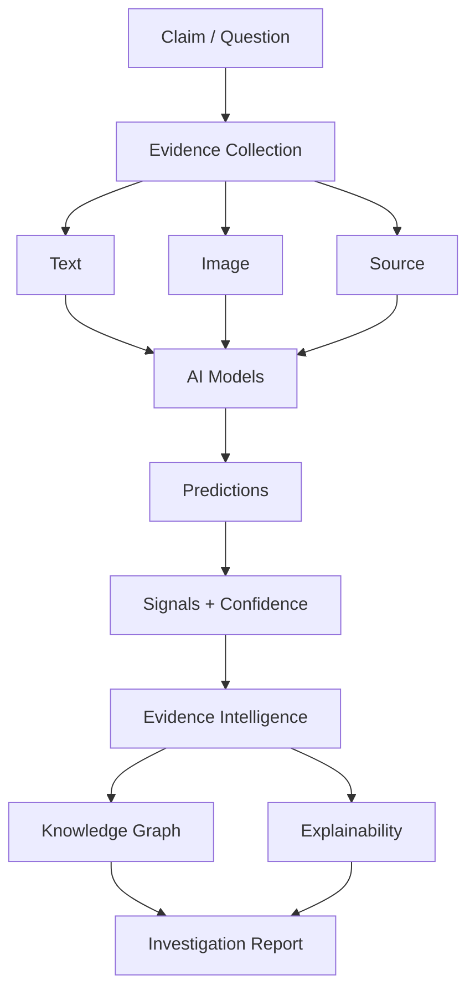
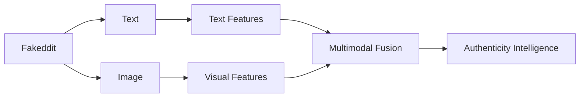
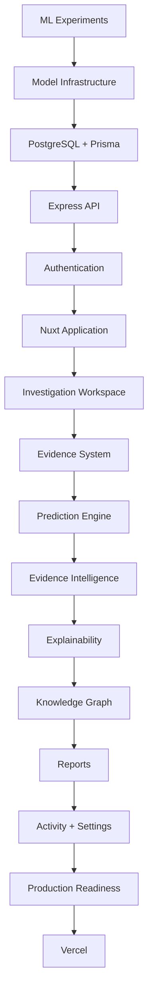
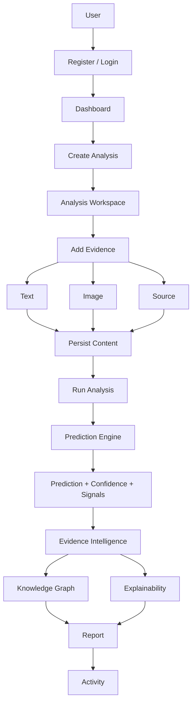
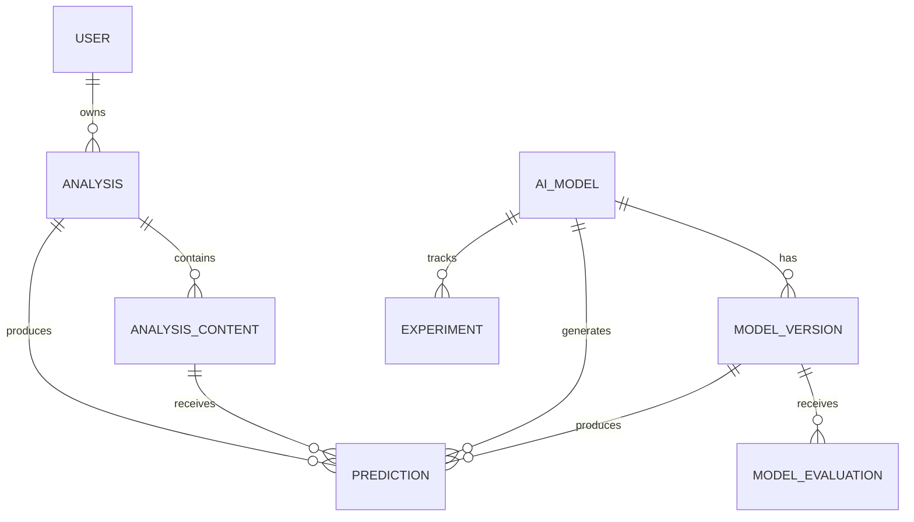
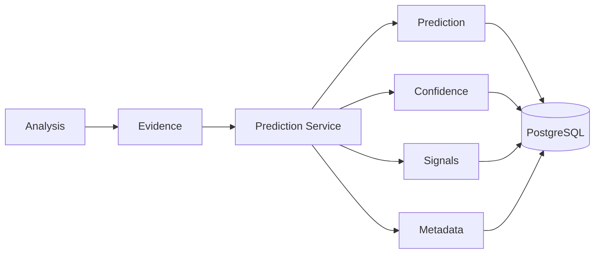
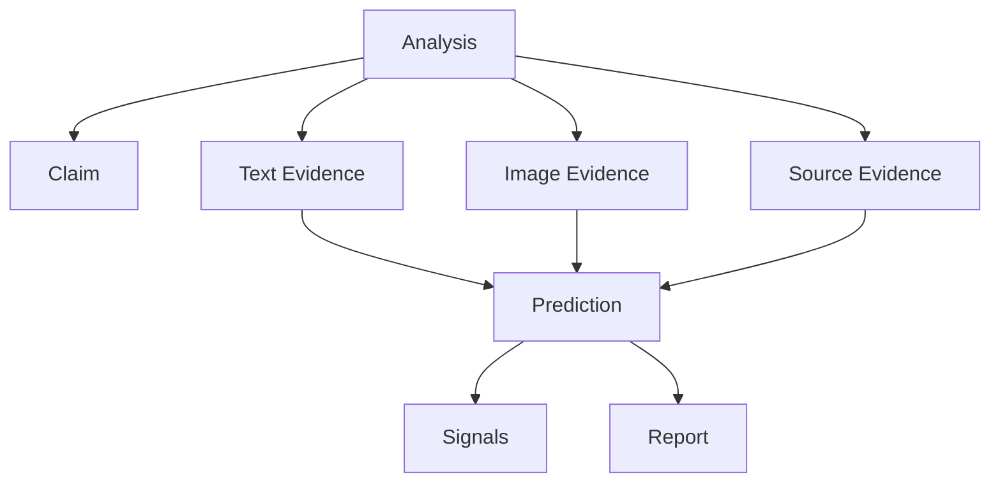
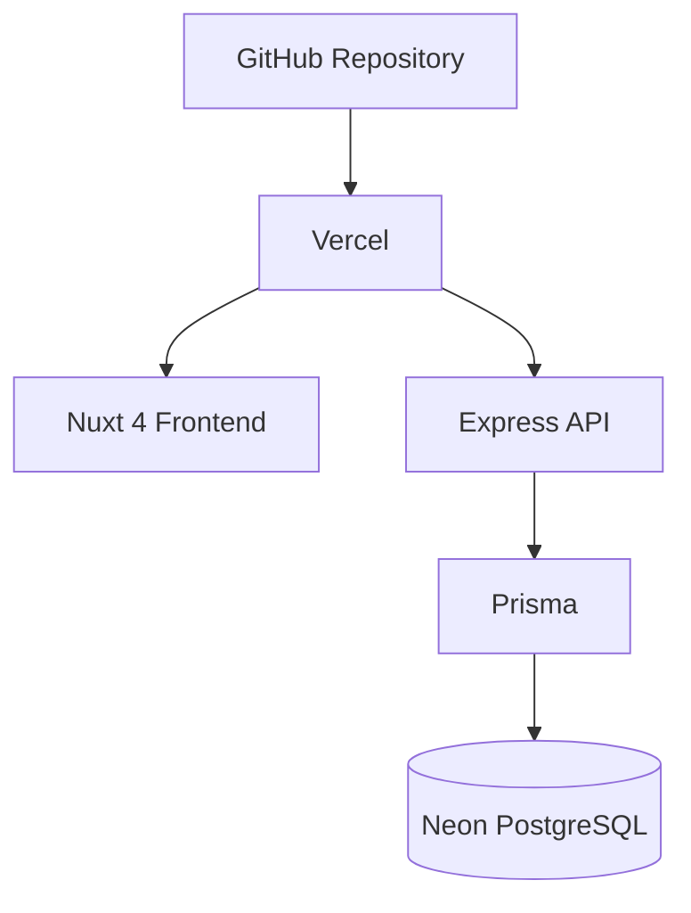
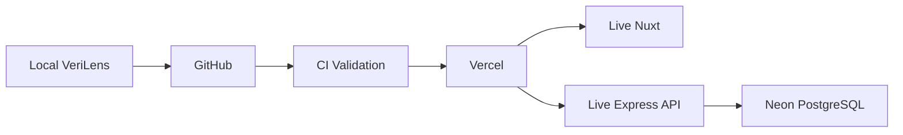
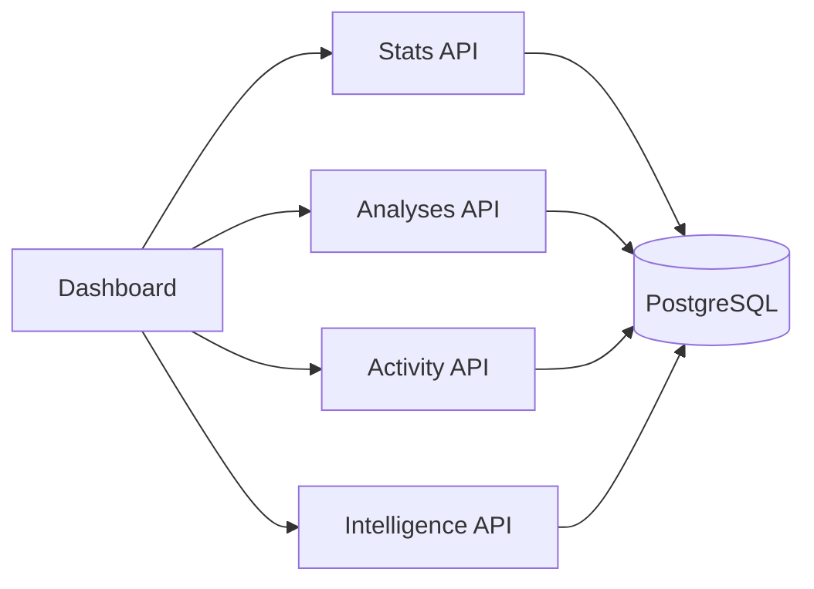

<!--
╔══════════════════════════════════════════════════════════════════════════════╗
║                              VERILENS README                                ║
║              Multimodal AI Authenticity & Evidence Intelligence             ║
╚══════════════════════════════════════════════════════════════════════════════╝
-->

# 🔎 VeriLens

### **Multimodal AI Authenticity & Evidence Intelligence Platform**

> **See the evidence. Understand the signals. Trace the story.**

<p align="center">

[](https://nuxt.com/)
[](https://vuejs.org/)
[](https://www.typescriptlang.org/)
[](https://expressjs.com/)
[](https://www.prisma.io/)
[](https://www.postgresql.org/)
[](https://neon.tech/)
[](https://authjs.dev/)
[](https://vercel.com/)

</p>

---

## 🖤 The Idea

VeriLens is a full-stack multimodal intelligence platform designed around one question:

> **What evidence supports an authenticity decision — and can a human actually understand it?**

Instead of reducing an investigation to a single black-box score, VeriLens connects:

```text
┌──────────────┐
│    CLAIM     │
└──────┬───────┘
       │
       ▼
┌─────────────────────────────────────┐
│              EVIDENCE               │
│                                     │
│   TEXT  ─────  IMAGE  ───── SOURCE  │
└──────────────────┬──────────────────┘
                   │
                   ▼
          ┌────────────────┐
          │  MODEL LAB     │
          └───────┬────────┘
                  │
                  ▼
          ┌────────────────┐
          │ PREDICTIONS    │
          │ + CONFIDENCE   │
          │ + SIGNALS      │
          └───────┬────────┘
                  │
                  ▼
       ┌────────────────────────┐
       │ EVIDENCE INTELLIGENCE  │
       └───────────┬────────────┘
                   │
          ┌────────┴────────┐
          ▼                 ▼
┌─────────────────┐  ┌─────────────────┐
│ KNOWLEDGE GRAPH │  │   EXPLAINABLE   │
│                 │  │     REPORT      │
└────────┬────────┘  └────────┬────────┘
         │                    │
         └──────────┬─────────┘
                    ▼
             🔎 INVESTIGATION
```

The product is built around **evidence-first intelligence**, not just classification.

---

# 📚 Table of Contents

- [✨ What is VeriLens?](#-what-is-verilens)
- [🎯 Problem](#-problem)
- [💡 Vision](#-vision)
- [🧭 Product Philosophy](#-product-philosophy)
- [🧠 ML Journey](#-ml-journey)
- [📊 Dataset Journey](#-dataset-journey)
- [📝 LIAR-2](#-liar-2)
- [🖼️ CIFAKE](#-cifake)
- [🧩 Fakeddit](#-fakeddit)
- [🔀 Multimodal Direction](#-multimodal-direction)
- [🏗️ Product Evolution](#-product-evolution)
- [⚙️ Tech Stack](#-tech-stack)
- [🧱 System Architecture](#-system-architecture)
- [🔄 Complete System Flow](#-complete-system-flow)
- [🎨 Frontend Architecture](#-frontend-architecture)
- [🚀 Backend Architecture](#-backend-architecture)
- [🗄️ Database Architecture](#-database-architecture)
- [🔐 Authentication](#-authentication)
- [📁 Evidence Architecture](#-evidence-architecture)
- [🤖 Model Lab](#-model-lab)
- [🔮 Prediction Engine](#-prediction-engine)
- [🕸️ Evidence Intelligence](#-evidence-intelligence)
- [🧠 Explainability](#-explainability)
- [🌐 Knowledge Graph](#-knowledge-graph)
- [⚡ AI Pipeline](#-ai-pipeline)
- [📑 Reports](#-reports)
- [📝 Activity](#-activity)
- [⚙️ Settings](#-settings)
- [📊 Dashboard](#-dashboard)
- [🛡️ Security](#-security)
- [🚀 Production Architecture](#-production-architecture)
- [🔁 CI/CD](#-cicd)
- [📂 Project Structure](#-project-structure)
- [🧪 Verification](#-verification)
- [🎨 Design System](#-design-system)
- [🛠️ Local Setup](#-local-setup)
- [🔑 Environment Variables](#-environment-variables)
- [🌐 API Reference](#-api-reference)
- [🗺️ Development Roadmap](#-development-roadmap)
- [🏁 Final State](#-final-state)

---

# ✨ What is VeriLens?

VeriLens is a **Multimodal AI Authenticity & Evidence Intelligence Platform**.

It combines:

- 📝 text authenticity intelligence
- 🖼️ image authenticity intelligence
- 🔗 source-oriented evidence
- 🤖 model management
- 🔮 prediction infrastructure
- 🧠 explainability
- 🕸️ relationship intelligence
- 📑 investigation reports
- 📝 activity history
- 🔐 authenticated workspaces

The system is designed around an investigation rather than an isolated prediction.

### The core loop

```text
CREATE INVESTIGATION
        ↓
ADD EVIDENCE
        ↓
RUN ANALYSIS
        ↓
GENERATE PREDICTIONS
        ↓
UNDERSTAND SIGNALS
        ↓
CONNECT EVIDENCE
        ↓
EXPLAIN RESULT
        ↓
GENERATE REPORT
```

---

# 🎯 Problem

Digital information increasingly combines:

- human-written content
- AI-generated content
- manipulated imagery
- incomplete sources
- conflicting evidence
- uncertain context
- multimodal information

A simple:

```text
"REAL"
```

or:

```text
"FAKE"
```

does not always tell the complete story.

VeriLens therefore asks:

```text
What was analyzed?
        ↓
What evidence was available?
        ↓
What did the model observe?
        ↓
How confident was it?
        ↓
What signals influenced the result?
        ↓
What other evidence is connected?
        ↓
Can the result be explained?
```

---

# 💡 Vision

The long-term vision is to create an investigation system where AI intelligence remains connected to the evidence that produced it.



---

# 🧭 Product Philosophy

## 1. Evidence first

The platform should make the underlying evidence visible.

## 2. No false certainty

If available evidence is insufficient, the system should be able to communicate uncertainty rather than invent a verdict.

## 3. Intelligence should be traceable

Predictions should connect back to:

- analysis
- evidence
- model
- version
- confidence
- signals
- metadata

## 4. Product state should be real

Dashboard statistics, activity, predictions, reports, and evidence should come from persisted application state.

## 5. Premium does not mean noisy

The interface uses cinematic visual language while protecting:

- readability
- hierarchy
- performance
- usability

---

# 🧠 ML Journey

VeriLens started as an ML problem before becoming a full-stack product.

The progression was:

```text
                    ┌──────────────┐
                    │ ML FOUNDATION│
                    └──────┬───────┘
                           │
            ┌──────────────┼──────────────┐
            ▼              ▼              ▼
         LIAR-2         CIFAKE        Fakeddit
            │              │              │
            ▼              ▼              ▼
          TEXT           IMAGE        MULTIMODAL
            │              │              │
            └──────────────┼──────────────┘
                           ▼
                  VERILENS INTELLIGENCE
                           │
                           ▼
                  FULL-STACK PRODUCT
```

The ML work established the foundation for the later product architecture.

---

# 📊 Dataset Journey

VeriLens worked through **three major dataset directions**:

| Dataset | Primary Role | Modality |
|---|---|---|
| 📝 LIAR-2 | Claim / text authenticity | Text |
| 🖼️ CIFAKE | Real vs AI-generated imagery | Image |
| 🧩 Fakeddit | Multimodal authenticity direction | Text + Image |

The progression intentionally moved from:

```text
TEXT
 ↓
IMAGE
 ↓
TEXT + IMAGE
 ↓
MULTIMODAL INTELLIGENCE
```

---

# 📝 LIAR-2

LIAR-2 formed the early claim and text-oriented foundation.

The work around the dataset established the text pipeline:

```text
RAW CLAIM DATA
      ↓
CLEANING
      ↓
PREPROCESSING
      ↓
TEXT REPRESENTATION
      ↓
MODEL TRAINING
      ↓
EVALUATION
      ↓
INFERENCE
```

The important contribution was not simply using a dataset.

It was establishing the first modality of VeriLens intelligence.

### Text intelligence direction

```text
CLAIM
 ↓
LANGUAGE
 ↓
FEATURES
 ↓
MODEL
 ↓
PREDICTION
```

---

# 🖼️ CIFAKE

CIFAKE established the computer-vision side of the project.

The prepared dataset direction was:

```text
100,000 IMAGES
│
├── 50,000 REAL
└── 50,000 FAKE
```

The CV pipeline became:

```text
IMAGE
 ↓
PREPROCESSING
 ↓
VISUAL REPRESENTATION
 ↓
MODEL
 ↓
AUTHENTICITY PREDICTION
```

This was the point where VeriLens moved beyond text.

---

# 🧩 Fakeddit

Fakeddit introduced the multimodal direction.

Instead of considering text and images independently, the project could reason about the presence of both.



The conceptual shift:

```text
TEXT-ONLY
    ↓
IMAGE-ONLY
    ↓
TEXT + IMAGE
    ↓
MULTIMODAL
```

---

# 🔀 Multimodal Direction

The dataset journey established the central product idea.

```text
┌─────────────────┐
│     LIAR-2      │
│      TEXT       │
└────────┬────────┘
         │
         │
┌────────▼────────┐
│     CIFAKE      │
│      IMAGE      │
└────────┬────────┘
         │
         │
┌────────▼────────┐
│    FAKEDDIT     │
│  TEXT + IMAGE   │
└────────┬────────┘
         │
         ▼
┌─────────────────────────┐
│   MULTIMODAL VERILENS   │
└─────────────────────────┘
```

This became the foundation for the product's evidence-first architecture.

---

# 🏗️ Product Evolution

VeriLens evolved through layers.



---

# ⚙️ Tech Stack

## 🎨 Frontend

| Technology | Purpose |
|---|---|
| **Nuxt 4** | Full-stack Vue application framework |
| **Vue 3** | Reactive UI |
| **TypeScript** | Type-safe application development |
| **Tailwind CSS** | UI styling |
| **Lucide / UI icons** | Product iconography |

## ⚡ Backend

| Technology | Purpose |
|---|---|
| **Node.js** | Runtime |
| **Express** | API server |
| **TypeScript** | Backend type safety |
| **Auth.js** | Authentication |
| **Helmet** | Security headers |
| **CORS** | Cross-origin control |
| **Multer** | Image upload handling |
| **express-rate-limit** | API protection |

## 🗄️ Data

| Technology | Purpose |
|---|---|
| **PostgreSQL** | Relational persistence |
| **Neon** | Hosted PostgreSQL |
| **Prisma** | ORM and migrations |

## 🧠 Intelligence

| Layer | Purpose |
|---|---|
| ML datasets | Training / experimentation foundation |
| Model Lab | Model registry |
| Model Versions | Versioned model metadata |
| Evaluations | Model evaluation records |
| Experiments | Experiment tracking |
| Prediction Engine | Inference orchestration |
| Signals | Structured prediction context |
| Evidence Intelligence | Investigation-level aggregation |

## 🚀 DevOps / Cloud

| Technology | Purpose |
|---|---|
| **GitHub** | Source control |
| **GitHub Actions** | CI validation |
| **Vercel** | Target deployment platform |
| **Neon** | Production database |

---

# 🧱 System Architecture

```text
                         ┌───────────────────┐
                         │       USER        │
                         └─────────┬─────────┘
                                   │
                                   ▼
                         ┌───────────────────┐
                         │     NUXT 4        │
                         │    VUE 3 + TS     │
                         └─────────┬─────────┘
                                   │
                              HTTP / Auth
                                   │
                                   ▼
                         ┌───────────────────┐
                         │     EXPRESS       │
                         │       API         │
                         └─────────┬─────────┘
                                   │
             ┌─────────────────────┼─────────────────────┐
             │                     │                     │
             ▼                     ▼                     ▼
      ┌─────────────┐       ┌─────────────┐       ┌─────────────┐
      │    AUTH     │       │   ROUTES    │       │  SERVICES   │
      │   AUTH.JS   │       │  ANALYSES   │       │ PREDICTION  │
      └─────────────┘       │  MODELS     │       │  ACTIVITY   │
                            │  SESSION    │       │   UPLOAD    │
                            │ INTELLIGENCE│       └──────┬──────┘
                            └──────┬──────┘              │
                                   │                     │
                                   └──────────┬──────────┘
                                              ▼
                                      ┌───────────────┐
                                      │    PRISMA     │
                                      └───────┬───────┘
                                              │
                                              ▼
                                      ┌───────────────┐
                                      │ NEON POSTGRES │
                                      └───────────────┘
```

---

# 🔄 Complete System Flow



---

# 🎨 Frontend Architecture

The frontend is built with Nuxt 4 and Vue 3.

```text
frontend/
└── app/
    ├── components/
    ├── composables/
    ├── layouts/
    └── pages/
        ├── dashboard/
        │   ├── index.vue
        │   ├── analyses/
        │   ├── evidence/
        │   ├── activity/
        │   ├── knowledge-graph/
        │   ├── model-lab/
        │   ├── pipeline/
        │   ├── reports/
        │   └── settings/
        └── auth/
```

### Frontend responsibilities

- rendering
- navigation
- interaction
- forms
- evidence ingestion
- analysis views
- model views
- intelligence visualization
- reports
- settings
- API communication

---

# 🚀 Backend Architecture

The Express application is organized around API boundaries and services.

```text
src/backend/
├── app.ts
├── server.ts
├── auth/
│   └── auth.ts
├── lib/
│   └── prisma.ts
├── routes/
│   ├── auth.routes.ts
│   ├── session.routes.ts
│   ├── analysis.routes.ts
│   ├── models.routes.ts
│   ├── activity.routes.ts
│   └── intelligence.routes.ts
└── services/
    ├── prediction.service.ts
    ├── activity.service.ts
    └── upload-storage.service.ts
```

---

# 🗄️ Database Architecture

Core relational structure:



### Main entities

```text
User
Analysis
AnalysisContent
AIModel
ModelVersion
ModelEvaluation
Experiment
Prediction
ActivityEvent
```

---

# 🔐 Authentication

VeriLens uses Auth.js Credentials.

```text
REGISTER
   ↓
PASSWORD
   ↓
HASH
   ↓
USER RECORD
   ↓
LOGIN
   ↓
AUTH.JS SESSION
   ↓
PROTECTED API
   ↓
PROTECTED PAGES
```

Protected resources verify the authenticated user before returning account-owned information.

---

# 📁 Evidence Architecture

VeriLens supports:

```text
📝 TEXT
🖼️ IMAGE
🔗 SOURCE
```

Every content item belongs to an analysis.

```text
ANALYSIS
   │
   ├── TEXT
   │
   ├── IMAGE
   │
   └── SOURCE
```

The API uses the canonical singular resource:

```text
/api/analyses/:analysisId/content
```

---

# 🤖 Model Lab

Model Lab is the model-management layer.

### Seeded models

```text
┌───────────────────────────────┐
│ Text Authenticity Model       │
├───────────────────────────────┤
│ AI-Generated Text Model       │
├───────────────────────────────┤
│ Image Authenticity Model      │
├───────────────────────────────┤
│ Multimodal Model              │
└───────────────────────────────┘
```

### Model lifecycle

```text
MODEL
  ↓
VERSION
  ↓
EVALUATION
  ↓
EXPERIMENT
  ↓
READY
  ↓
DEPLOYED
```

---

# 🔮 Prediction Engine

The Prediction Engine creates persisted prediction records.



A prediction contains:

```text
prediction
confidence
signals
metadata
analysisId
contentId
modelId
modelVersionId
status
createdAt
updatedAt
```

---

# 🕸️ Evidence Intelligence

Evidence Intelligence aggregates investigation-wide context.

```text
┌───────────────┐
│    ANALYSIS   │
└───────┬───────┘
        │
   ┌────┼────┐
   ▼    ▼    ▼
 TEXT IMAGE SOURCE
   │    │    │
   └────┼────┘
        ▼
   PREDICTIONS
        │
        ▼
    CONFIDENCE
        │
        ▼
      SIGNALS
        │
        ▼
EVIDENCE INTELLIGENCE
```

The Evidence page can aggregate evidence across analyses and expose analysis and prediction context.

---

# 🧠 Explainability

Explainability connects outputs to the information behind them.

```text
PREDICTION
    │
    ├── CONFIDENCE
    ├── SIGNALS
    ├── METADATA
    ├── EVIDENCE
    ├── MODEL
    └── MODEL VERSION
             │
             ▼
        EXPLANATION
```

A key design rule:

> **Never manufacture certainty that the evidence does not support.**

Reports therefore support a clear **no overall verdict** state.

---

# 🌐 Knowledge Graph

The Knowledge Graph is the relationship view of an investigation.



The graph makes relationships easier to reason about than a flat list of records.

---

# ⚡ AI Pipeline

The AI Pipeline is the process view.

```text
┌───────────┐
│  INGEST   │
└─────┬─────┘
      ↓
┌───────────┐
│ NORMALIZE │
└─────┬─────┘
      ↓
┌───────────┐
│  ANALYZE  │
└─────┬─────┘
      ↓
┌───────────┐
│  SIGNALS  │
└─────┬─────┘
      ↓
┌───────────┐
│  PREDICT  │
└─────┬─────┘
      ↓
┌───────────┐
│  EVIDENCE │
└─────┬─────┘
      ↓
┌───────────┐
│ EXPLAIN   │
└─────┬─────┘
      ↓
┌───────────┐
│  REPORT   │
└───────────┘
```

---

# 📑 Reports

Reports bring investigation context together.

```text
REPORT
│
├── Analysis
├── Evidence
├── Predictions
├── Confidence
├── Signals
├── Relationships
├── Explanation
└── Verdict State
```

The product distinguishes between:

```text
SUPPORTED CONCLUSION
```

and:

```text
INSUFFICIENT EVIDENCE
```

This prevents a visually polished report from pretending to know more than the underlying data supports.

---

# 📝 Activity

Activity provides a persistent event history.

```text
USER / SYSTEM ACTION
        ↓
 ACTIVITY EVENT
        ↓
    DATABASE
        ↓
 ACTIVITY PAGE
```

The `ActivityEvent` model records meaningful product activity.

The migration:

```text
20261001190000_add_activity_events
```

has been applied successfully to the Neon database.

---

# ⚙️ Settings

Settings are part of the authenticated application layer.

```text
AUTHENTICATED USER
        ↓
     SETTINGS
        ↓
ACCOUNT CONTEXT
        ↓
SESSION / ACCOUNT CONTROLS
```

The product also supports sign-out.

---

# 📊 Dashboard

The dashboard is the product control center.

```text
WORKSPACE
├── 🏠 Overview
├── 🔎 Analyses
├── 🧠 Evidence
└── 🕸️ Knowledge Graph

INTELLIGENCE
├── 🤖 Model Lab
├── ⚡ AI Pipeline
└── 📑 Reports

SYSTEM
├── 📝 Activity
└── ⚙️ Settings
```

Dashboard statistics are connected to backend data rather than being purely decorative UI.

---

# 🛡️ Security

Security layers include:

```text
                  SECURITY
                     │
      ┌──────────────┼──────────────┐
      ▼              ▼              ▼
   Helmet          CORS        Rate Limiting
      │              │              │
      └──────────────┼──────────────┘
                     ▼
               Authentication
                     │
                     ▼
             Ownership Checks
                     │
                     ▼
              Upload Validation
                     │
                     ▼
             Safe Error Responses
```

Implemented considerations include:

- Helmet
- configured CORS
- rate limiting
- Auth.js
- authenticated routes
- ownership checks
- upload validation
- environment-based secrets
- controlled API errors

---

# 🚀 Production Architecture

The final target is Vercel.



### Production target

```text
                 GITHUB
                   │
                   ▼
                VERCEL
              ┌────┴────┐
              ▼         ▼
           NUXT 4    EXPRESS
           FRONTEND    API
                         │
                         ▼
                      PRISMA
                         │
                         ▼
                    NEON POSTGRES
```

Persistent object storage must be handled separately for durable uploaded files because local serverless filesystem storage is not a production persistence layer.

---

# 🔁 CI/CD

GitHub Actions validates the project before deployment.

```text
PUSH
 ↓
CHECKOUT
 ↓
INSTALL
 ↓
PRISMA GENERATE
 ↓
TYPE CHECK
 ↓
NUXT BUILD
 ↓
READY FOR DEPLOYMENT
```

The workflow is intentionally compact.

The objective is to catch:

- type failures
- Prisma generation failures
- build failures

before production.

---

# 📂 Project Structure

```text
VeriLens/
│
├── frontend/
│   ├── app/
│   │   ├── components/
│   │   ├── composables/
│   │   ├── layouts/
│   │   └── pages/
│   │       ├── dashboard/
│   │       │   ├── analyses/
│   │       │   ├── evidence/
│   │       │   ├── activity/
│   │       │   ├── knowledge-graph/
│   │       │   ├── model-lab/
│   │       │   ├── pipeline/
│   │       │   ├── reports/
│   │       │   └── settings/
│   │       └── auth/
│   └── nuxt.config.ts
│
├── src/
│   └── backend/
│       ├── app.ts
│       ├── server.ts
│       ├── auth/
│       ├── lib/
│       ├── routes/
│       └── services/
│
├── prisma/
│   ├── schema.prisma
│   └── migrations/
│
├── uploads/
│   └── images/
│
├── .github/
│   └── workflows/
│
├── .env.example
├── .gitignore
└── README.md
```

---

# 🧪 Verification

The implementation has been verified through:

```text
✅ Prisma Client generation
✅ Prisma validation
✅ TypeScript check
✅ Nuxt production build
✅ API health smoke test
✅ Authentication/product flow testing
✅ Analysis creation
✅ Evidence ingestion
✅ Model Lab
✅ Prediction infrastructure
✅ Evidence Intelligence
✅ Knowledge Graph
✅ AI Pipeline
✅ Reports
✅ Activity
✅ Settings
✅ Database migration deployment
```

Health check:

```text
GET /api/health
        ↓
HTTP 200
```

---

# 🎨 Design System

VeriLens uses a premium editorial visual direction.

### Palette language

```text
WARM CREAM
     +
SAGE
     +
OLIVE
     +
SOFT GLASS
     +
SUBTLE BORDER
     +
CONTROLLED GLOW
```

### Design principles

```text
PURPOSEFUL GLASSMORPHISM
        ↓
CINEMATIC MOTION
        ↓
CLEAR HIERARCHY
        ↓
FAST INTERACTION
        ↓
EVIDENCE-FIRST UI
```

The goal is not to make every surface glow.

The goal is to make the interface feel like a serious intelligence workspace.

---

# 🛠️ Local Setup

## 1️⃣ Clone

```bash
git clone <repository-url>
cd VeriLens
```

## 2️⃣ Install root dependencies

```bash
npm install
```

## 3️⃣ Install frontend dependencies

```bash
cd frontend
npm install
```

## 4️⃣ Return to root

```bash
cd ..
```

## 5️⃣ Configure environment

Create:

```text
.env
```

from:

```text
.env.example
```

## 6️⃣ Generate Prisma Client

```bash
npx prisma generate
```

## 7️⃣ Apply migrations

For an existing production-style database:

```bash
npx prisma migrate deploy
```

## 8️⃣ Start backend

```bash
npx tsx src/backend/server.ts
```

## 9️⃣ Start frontend

In another terminal:

```bash
cd frontend
npm run dev
```

---

# 🔑 Environment Variables

Example:

```env
DATABASE_URL=
AUTH_SECRET=
AUTH_URL=http://localhost:5000
AUTH_TRUST_HOST=true
FRONTEND_URL=http://localhost:3000
API_PORT=5000
NUXT_PUBLIC_API_BASE=http://localhost:5000
```

### Production

Production values should be configured through Vercel environment variables.

Never commit:

```text
.env
```

Never expose:

```text
AUTH_SECRET
DATABASE_URL
```

---

# 🌐 API Reference

## ❤️ Health

```http
GET /api/health
```

## 📊 Analysis

```http
GET    /api/analyses
GET    /api/analyses/stats
POST   /api/analyses
GET    /api/analyses/:analysisId
PATCH  /api/analyses/:analysisId
DELETE /api/analyses/:analysisId
```

## 📁 Evidence

```http
GET    /api/analyses/:analysisId/content
POST   /api/analyses/:analysisId/content/text
POST   /api/analyses/:analysisId/content/source
POST   /api/analyses/:analysisId/content/image
DELETE /api/analyses/:analysisId/content/:contentId
```

## 🔮 Prediction

```http
POST /api/analyses/:analysisId/predict/:contentId
GET  /api/analyses/:analysisId/predictions
```

## 🤖 Models

```http
GET  /api/models
POST /api/models
GET  /api/models/:id
POST /api/models/:id/versions
POST /api/models/:id/versions/:versionId/evaluations
POST /api/models/:id/experiments
GET  /api/models/:id/experiments
```

## 📝 Activity

```http
GET /api/activity
```

## 🕸️ Intelligence

```http
GET /api/intelligence/graph
```

## 🔐 Session

```http
GET /api/session/me
```

---

# 🧭 Development Roadmap

## Phase 0 — Foundation

```text
Project setup
Environment
Repository
Initial architecture
```

### Status

✅ Completed

---

## Phase 1 — ML Foundation

```text
Dataset preparation
Text authenticity
Feature preparation
Initial experimentation
```

### Status

✅ Completed

---

## Phase 2 — Text Intelligence

```text
LIAR-2
Text preprocessing
Text modelling
Evaluation
Inference direction
```

### Status

✅ Completed

---

## Phase 3 — Computer Vision

```text
CIFAKE
Image preprocessing
Real / Fake direction
CV experimentation
```

### Status

✅ Completed

---

## Phase 4 — Multimodal Direction

```text
Fakeddit
Text + image
Multimodal reasoning direction
```

### Status

✅ Completed

---

## Phase 5 — Model Infrastructure

```text
Model registry
Model versions
Evaluations
Experiments
```

### Status

✅ Completed

---

## Phase 6 — Database

```text
PostgreSQL
Neon
Prisma
Migrations
Relationships
```

### Status

✅ Completed

---

## Phase 7 — Backend

```text
Express
Routes
Services
Validation
Health checks
Security middleware
```

### Status

✅ Completed

---

## Phase 8 — Authentication

```text
Register
Login
Sessions
Protected routes
Logout
```

### Status

✅ Completed

---

## Phase 9 — Full-Stack Foundation

```text
Nuxt
Express
Prisma
Auth
Frontend ↔ Backend
```

### Status

✅ Completed

---

## Phase 10 — Investigation Management

```text
Create analysis
List analyses
Update analysis
Delete analysis
Analysis statuses
```

### Status

✅ Completed

---

## Phase 11 — Evidence

```text
Text
Image
Source
Persistence
Ownership
```

### Status

✅ Completed

---

## Phase 12 — Model Lab

```text
Models
Versions
Evaluations
Experiments
Model UI
```

### Status

✅ Completed

---

## Phase 13 — Prediction Engine

```text
Prediction service
Prediction records
Confidence
Signals
Metadata
```

### Status

✅ Completed

---

## Phase 14 — Evidence Intelligence

```text
Evidence aggregation
Prediction aggregation
Search
Filtering
Confidence display
```

### Status

✅ Completed

---

## Phase 15 — Explainability

```text
Signals
Evidence context
Prediction context
Report explanation
No-verdict state
```

### Status

✅ Completed

---

## Phase 16 — Knowledge Graph

```text
Investigation relationships
Evidence relationships
Prediction relationships
Interactive graph
```

### Status

✅ Completed

---

## Phase 17 — AI Pipeline

```text
Ingestion
Processing
Prediction
Evidence
Explanation
```

### Status

✅ Completed

---

## Phase 18 — Reports

```text
Investigation context
Evidence
Predictions
Signals
Explainability
Verdict state
```

### Status

✅ Completed

---

## Phase 19 — Activity

```text
ActivityEvent
Migration
Activity API
Activity UI
```

### Status

✅ Completed

---

## Phase 20 — Settings

```text
Authenticated settings
Account context
Sign-out
```

### Status

✅ Completed

---

## Phase 21 — Dashboard Integration

```text
Live statistics
Search
Navigation
Cards
Cross-page flow
```

### Status

✅ Completed

---

## Phase 22 — Security

```text
Helmet
CORS
Rate limiting
Ownership checks
Upload validation
Safe errors
```

### Status

✅ Completed

---

## Phase 23 — CI/CD

```text
GitHub Actions
Prisma generate
TypeScript check
Nuxt build
```

### Status

✅ Completed

---

## Phase 24 — Production Readiness

```text
Environment configuration
Production Auth.js
Production CORS
Health checks
Logging
Error handling
Vercel preparation
```

### Status

✅ Completed

---

## Phase 25 — Deployment

```text
GitHub
 ↓
Vercel
 ↓
Production
```

### Status

⏳ Final deployment stage

---

# 📈 Project Journey at a Glance

```text
                VERILENS JOURNEY

     DATA
      │
      ▼
   ┌───────┐
   │LIAR-2 │────── TEXT
   └───┬───┘
       │
       ▼
   ┌────────┐
   │ CIFAKE │───── IMAGE
   └───┬────┘
       │
       ▼
  ┌──────────┐
  │ FAKEDDIT │──── TEXT + IMAGE
  └────┬─────┘
       │
       ▼
 ┌─────────────┐
 │ ML CORE     │
 └──────┬──────┘
        ▼
 ┌─────────────┐
 │ MODEL LAB   │
 └──────┬──────┘
        ▼
 ┌─────────────┐
 │ PREDICTION  │
 └──────┬──────┘
        ▼
 ┌─────────────┐
 │   EVIDENCE  │
 └──────┬──────┘
        ▼
 ┌─────────────┐
 │ INTELLIGENCE│
 └──────┬──────┘
        ▼
 ┌─────────────┐
 │ EXPLAINABLE │
 │   REPORTS   │
 └──────┬──────┘
        ▼
 ┌─────────────┐
 │ FULL-STACK  │
 │ INVESTIGATE │
 └──────┬──────┘
        ▼
 ┌─────────────┐
 │ PRODUCTION  │
 └──────┬──────┘
        ▼
     VERCEL
```

---

# 🧩 Architecture Principles

### Frontend

```text
Nuxt
 ↓
Vue
 ↓
Components
 ↓
Pages
 ↓
Composables
 ↓
API
```

### Backend

```text
Express
 ↓
Routes
 ↓
Services
 ↓
Prisma
 ↓
PostgreSQL
```

### Intelligence

```text
Evidence
 ↓
Prediction Service
 ↓
Signals
 ↓
Confidence
 ↓
Evidence Intelligence
 ↓
Explanation
```

### Production

```text
GitHub
 ↓
CI
 ↓
Vercel
 ↓
Nuxt + Express
 ↓
Neon
```

---

# 🧠 What Was Built

VeriLens is not one feature.

It is a chain of engineering layers.

```text
                     VERILENS
                         │
        ┌────────────────┼────────────────┐
        │                │                │
        ▼                ▼                ▼
       ML            FULL STACK        PRODUCT
        │                │                │
        ▼                ▼                ▼
   LIAR-2/CIFAKE     Nuxt/Express      Dashboard
   Fakeddit          Prisma/Neon       Evidence
        │            Auth.js           Graph
        ▼                │             Reports
   Model Lab             ▼             Activity
   Prediction        APIs              Settings
   Signals
```

---

# 🏁 Final State

At the end of the engineering phase, VeriLens contains:

```text
🧠 ML FOUNDATION                 ✅
📝 LIAR-2                       ✅
🖼️ CIFAKE                       ✅
🧩 FAKEDDIT                     ✅
🤖 MODEL LAB                    ✅
🔮 PREDICTION ENGINE            ✅
🗄️ POSTGRESQL / NEON            ✅
⚡ EXPRESS API                  ✅
🎨 NUXT 4 / VUE 3               ✅
🔐 AUTH.JS                      ✅
🔎 ANALYSIS MANAGEMENT          ✅
📁 EVIDENCE SYSTEM              ✅
🕸️ KNOWLEDGE GRAPH              ✅
⚡ AI PIPELINE                  ✅
🧠 EVIDENCE INTELLIGENCE        ✅
💡 EXPLAINABILITY               ✅
📑 REPORTS                      ✅
📝 ACTIVITY                     ✅
⚙️ SETTINGS                     ✅
🛡️ SECURITY                    ✅
🔁 CI/CD                        ✅
🚀 PRODUCTION PREPARATION       ✅
☁️ VERCEL DEPLOYMENT            ⏳
```

---

# ☁️ Final Deployment Path



The final remaining product milestone is deployment.

---

# 🖤 Closing

VeriLens started with datasets.

Then came models.

Then evidence.

Then predictions.

Then intelligence.

Then explanation.

Then a full-stack investigation system.

```text
DATA
  ↓
MODELS
  ↓
PREDICTIONS
  ↓
EVIDENCE
  ↓
INTELLIGENCE
  ↓
EXPLANATION
  ↓
INVESTIGATION
  ↓
PRODUCT
  ↓
PRODUCTION
```

> ### **See the evidence. Understand the signals. Trace the story.**

## 🔎 VeriLens

**Multimodal AI Authenticity & Evidence Intelligence Platform**

---

<p align="center">

### Built with 🧠 AI • 📝 Evidence • 🔎 Investigation • ⚡ Engineering

**From ML experiments to a production-ready full-stack intelligence platform.**

</p>


---

# 📘 Implementation Appendix

## A. Core Domain Model

```text
USER
 │
 └── ANALYSES
       │
       ├── ANALYSIS CONTENT
       │      ├── TEXT
       │      ├── IMAGE
       │      └── SOURCE
       │
       └── PREDICTIONS
              ├── MODEL
              ├── MODEL VERSION
              ├── CONFIDENCE
              ├── SIGNALS
              └── METADATA
```

## B. Model Domain

```text
AI MODEL
   │
   ├── VERSION
   │      └── EVALUATION
   │
   ├── EXPERIMENT
   │
   └── PREDICTION
```

## C. Activity Domain

```text
ACTION
  ↓
ACTIVITY EVENT
  ↓
ANALYSIS / USER CONTEXT
  ↓
PERSISTENCE
  ↓
ACTIVITY UI
```

## D. Investigation Domain

```text
INVESTIGATION
│
├── INPUT
│
├── EVIDENCE
│
├── MODELS
│
├── PREDICTIONS
│
├── SIGNALS
│
├── RELATIONSHIPS
│
├── REPORT
│
└── ACTIVITY
```

---

# 🧭 Navigation Model

The application intentionally groups navigation by user intent.

```text
WORKSPACE
    ↓
Understand the investigation

INTELLIGENCE
    ↓
Understand what the system discovered

SYSTEM
    ↓
Understand and manage the platform
```

## Workspace

```text
Overview
Analyses
Evidence
Knowledge Graph
```

## Intelligence

```text
Model Lab
AI Pipeline
Reports
```

## System

```text
Activity
Settings
```

This separation keeps the dashboard readable as the product grows.

---

# 🔎 Analysis Flow

```text
DASHBOARD
   ↓
ANALYSES
   ↓
CREATE
   ↓
TITLE
   ↓
ANALYSIS RECORD
   ↓
WORKSPACE
```

The analysis becomes the container for every later investigation operation.

---

# 📝 Text Evidence Flow

```text
USER
 ↓
ADD TEXT
 ↓
VALIDATE
 ↓
POST /content/text
 ↓
ANALYSIS CONTENT
 ↓
DATABASE
 ↓
WORKSPACE
 ↓
RUN ANALYSIS
```

---

# 🖼️ Image Evidence Flow

```text
USER
 ↓
SELECT IMAGE
 ↓
UPLOAD VALIDATION
 ↓
MULTER
 ↓
UPLOAD STORAGE
 ↓
ANALYSIS CONTENT
 ↓
DATABASE
 ↓
IMAGE EVIDENCE
```

Production deployment must replace ephemeral local storage with durable object storage where required.

---

# 🔗 Source Evidence Flow

```text
USER
 ↓
SOURCE URL
 ↓
VALIDATION
 ↓
POST /content/source
 ↓
ANALYSIS CONTENT
 ↓
DATABASE
 ↓
SOURCE EVIDENCE
```

---

# 🔮 Prediction Flow

```text
RUN ANALYSIS
     ↓
SELECT / DISCOVER EVIDENCE
     ↓
PREDICTION SERVICE
     ↓
MODEL LOGIC
     ↓
PREDICTION RESULT
     ↓
CONFIDENCE
     ↓
SIGNALS
     ↓
METADATA
     ↓
PERSIST
```

---

# 📊 Dashboard Data Flow



The dashboard is therefore connected to backend state.

---

# 🧠 Explainability Flow

```text
PREDICTION
   │
   ├──────────────┐
   ▼              ▼
CONFIDENCE      SIGNALS
   │              │
   └──────┬───────┘
          ▼
       EVIDENCE
          │
          ▼
      CONTEXT
          │
          ▼
     EXPLANATION
```

---

# 🕸️ Graph Flow

```text
ANALYSIS
   ↓
ENTITIES
   ↓
RELATIONSHIPS
   ↓
GRAPH DATA
   ↓
INTERACTIVE GRAPH
```

The graph is a visual interpretation of investigation relationships.

---

# 📑 Report Flow

```text
ANALYSIS
  +
EVIDENCE
  +
PREDICTIONS
  +
SIGNALS
  +
RELATIONSHIPS
  +
EXPLANATION
       ↓
     REPORT
```

---

# 📝 Activity Flow

```text
USER ACTION
    ↓
BACKEND
    ↓
ACTIVITY SERVICE
    ↓
ACTIVITY EVENT
    ↓
DATABASE
    ↓
ACTIVITY PAGE
```

---

# 🛡️ Request Security Flow

```text
REQUEST
  ↓
CORS
  ↓
HELMET
  ↓
RATE LIMIT
  ↓
AUTHENTICATION
  ↓
OWNERSHIP
  ↓
VALIDATION
  ↓
ROUTE
  ↓
SERVICE
  ↓
DATABASE
```

---

# 🧱 Layered Architecture

```text
┌─────────────────────────────────────────────┐
│                 PRESENTATION                │
│                Nuxt / Vue                   │
├─────────────────────────────────────────────┤
│                  API LAYER                  │
│                 Express                    │
├─────────────────────────────────────────────┤
│                SERVICE LAYER                │
│       Prediction / Activity / Upload       │
├─────────────────────────────────────────────┤
│                DATA ACCESS                  │
│                  Prisma                     │
├─────────────────────────────────────────────┤
│                  DATABASE                   │
│              PostgreSQL / Neon              │
└─────────────────────────────────────────────┘
```

---

# 🧪 Engineering Verification Matrix

| Layer | Verification |
|---|---|
| Prisma | Generate + validate |
| Backend | TypeScript check |
| API | Health smoke test |
| Database | Migration deployment |
| Frontend | Production build |
| Authentication | Registration / login flow |
| Analysis | Creation + management |
| Evidence | Text / image / source |
| Models | Model Lab |
| Prediction | Prediction infrastructure |
| Intelligence | Evidence aggregation |
| Reports | Explainability state |
| Activity | Event persistence |
| Settings | Protected access |
| CI | GitHub Actions |

---

# 🗃️ Database Migration State

The production-style database migration sequence includes the project schema evolution.

The ActivityEvent migration was deployed using:

```bash
npx prisma migrate deploy
```

The successful migration:

```text
20261001190000_add_activity_events
```

was applied to the Neon PostgreSQL database.

---

# 🧰 Developer Commands

## Backend

```bash
npx tsx src/backend/server.ts
```

## Frontend

```bash
cd frontend
npm run dev
```

## Build

```bash
cd frontend
npm run build
```

## Prisma

```bash
npx prisma generate
```

```bash
npx prisma validate
```

```bash
npx prisma migrate deploy
```

---

# 🚦 Runtime Model

Local:

```text
localhost:3000
      │
      ▼
   Nuxt 4
      │
      ▼
localhost:5000
      │
      ▼
   Express
      │
      ▼
   Prisma
      │
      ▼
   Neon
```

Production:

```text
Vercel
 ├── Nuxt
 └── Express
       │
       ▼
     Prisma
       │
       ▼
     Neon
```

---

# 🌱 Environment Separation

```text
LOCAL
 ↓
.env
 ↓
localhost URLs
 ↓
local development
```

```text
PRODUCTION
 ↓
Vercel Environment Variables
 ↓
production domains
 ↓
production database
```

No production secret belongs in the repository.

---

# 🧩 Why Prisma

Prisma provides:

```text
SCHEMA
 ↓
MIGRATION
 ↓
CLIENT
 ↓
TYPE-SAFE QUERY
 ↓
POSTGRESQL
```

This keeps the application data model explicit.

---

# 🧩 Why PostgreSQL

The investigation domain is relational.

Relationships matter:

```text
USER
 ↓
ANALYSIS
 ↓
EVIDENCE
 ↓
PREDICTION
 ↓
MODEL
 ↓
REPORT
```

PostgreSQL is therefore a natural persistence foundation for the product.

---

# 🧩 Why Express

Express provides a clear API boundary.

```text
NUXT
  ↓
HTTP
  ↓
EXPRESS
  ↓
BUSINESS LOGIC
  ↓
PRISMA
```

This keeps backend concerns separate from frontend presentation.

---

# 🧩 Why Nuxt

Nuxt provides:

```text
Vue
+
Routing
+
Application structure
+
Runtime configuration
+
Production build
```

The result is a structured Vue application suitable for a multi-page intelligence product.

---

# 🧩 Why Auth.js

Authentication needs:

```text
Credentials
+
Sessions
+
Protected routes
+
Production configuration
```

Auth.js provides the authentication foundation while user records remain in PostgreSQL.

---

# 📦 Feature Inventory

## Investigation

```text
Create
Read
Update
Delete
Status
```

## Evidence

```text
Text
Image
Source
Search
Filtering
```

## Intelligence

```text
Models
Predictions
Confidence
Signals
Graph
Pipeline
Reports
```

## System

```text
Activity
Settings
Authentication
Logout
```

---

# 📊 Product Surface Map

```text
                         DASHBOARD
                             │
        ┌────────────────────┼────────────────────┐
        │                    │                    │
        ▼                    ▼                    ▼
    WORKSPACE           INTELLIGENCE           SYSTEM
        │                    │                    │
        ├─ Analyses          ├─ Model Lab        ├─ Activity
        ├─ Evidence          ├─ AI Pipeline      └─ Settings
        └─ Graph             └─ Reports
```

---

# 🎯 Product Goals

### Goal 01

Make authenticity analysis multimodal.

### Goal 02

Make evidence first-class.

### Goal 03

Persist investigation state.

### Goal 04

Make predictions explainable.

### Goal 05

Connect evidence and intelligence.

### Goal 06

Create a polished full-stack experience.

### Goal 07

Prepare the system for production deployment.

---

# 🧠 Intelligence Principles

```text
MODEL OUTPUT
    ≠
FINAL TRUTH
```

Instead:

```text
MODEL OUTPUT
     +
EVIDENCE
     +
SIGNALS
     +
CONTEXT
     =
INVESTIGATION INSIGHT
```

This is one of the central ideas behind VeriLens.

---

# 🔍 Evidence Principles

Evidence should be:

```text
IDENTIFIABLE
     ↓
PERSISTED
     ↓
CONNECTED
     ↓
ANALYZED
     ↓
EXPLAINED
```

---

# 🧠 Model Principles

Models should have identity.

```text
MODEL
 ↓
VERSION
 ↓
EVALUATION
 ↓
EXPERIMENT
 ↓
PREDICTION
```

This avoids treating the AI layer as one giant opaque function.

---

# 📑 Reporting Principles

A report should answer:

```text
WHAT?
WHY?
BASED ON WHAT?
HOW CONFIDENT?
WHAT EVIDENCE?
WHAT REMAINS UNCERTAIN?
```

---

# 🎨 Visual Principles

```text
LESS DECORATION
      +
MORE HIERARCHY
      +
MORE CONTEXT
      +
MORE PURPOSE
```

The interface should communicate state visually.

---

# 🚀 Deployment Readiness

Before deployment:

```text
□ Git clean / reviewed
□ README final
□ Environment variables configured
□ Secrets protected
□ Prisma migrations committed
□ Production database ready
□ Auth URL ready
□ Frontend URL ready
□ API base ready
□ CORS ready
□ Upload strategy ready
□ Build passing
□ Type check passing
□ Health endpoint passing
```

---

# ☁️ Vercel Endgame

The final sequence:

```text
                 LOCAL
                   │
                   ▼
                GITHUB
                   │
                   ▼
             GITHUB ACTIONS
                   │
                   ▼
                VERCEL
              ┌────┴────┐
              ▼         ▼
            NUXT      EXPRESS
                       │
                       ▼
                     PRISMA
                       │
                       ▼
                     NEON
```

---

# 🏆 What the Project Demonstrates

VeriLens demonstrates work across:

```text
🧠 Machine Learning
📝 NLP
🖼️ Computer Vision
🧩 Multimodal AI
🎨 Frontend Engineering
⚡ Backend Engineering
🗄️ Database Engineering
🔐 Authentication
🛡️ API Security
📊 Data Modeling
🤖 Model Infrastructure
🔮 Prediction Systems
🕸️ Graph Visualization
📑 Explainability
🔁 CI/CD
☁️ Cloud Deployment Preparation
```

---

# 💫 The Full Story

```text
                         VERILENS
                            │
                            ▼
                       THE QUESTION
                            │
                            ▼
                     WHAT IS AUTHENTIC?
                            │
                            ▼
                         DATASETS
                            │
             ┌──────────────┼──────────────┐
             ▼              ▼              ▼
           LIAR-2         CIFAKE        FAKEDDIT
             │              │              │
             └──────────────┼──────────────┘
                            ▼
                         ML CORE
                            │
                            ▼
                       MODEL LAB
                            │
                            ▼
                    PREDICTION ENGINE
                            │
                            ▼
                       EVIDENCE
                            │
                            ▼
                  EVIDENCE INTELLIGENCE
                            │
                ┌───────────┴───────────┐
                ▼                       ▼
         KNOWLEDGE GRAPH          EXPLAINABILITY
                │                       │
                └───────────┬───────────┘
                            ▼
                          REPORT
                            │
                            ▼
                        ACTIVITY
                            │
                            ▼
                        SETTINGS
                            │
                            ▼
                      PRODUCTION
                            │
                            ▼
                         VERCEL
```

---

# 🖤 Final Note

This README is intentionally more than documentation.

It is the public technical story of VeriLens.

It shows:

```text
WHERE IT STARTED
       ↓
WHAT WAS LEARNED
       ↓
WHAT WAS BUILT
       ↓
HOW IT CONNECTS
       ↓
HOW IT IS ENGINEERED
       ↓
HOW IT WILL SHIP
```

> **VeriLens is an investigation system built from the ML foundation upward.**

> **Evidence is not an attachment to the result. Evidence is the story behind the result.**

---

<p align="center">

# 🔎 VERILENS

### **See the evidence. Understand the signals. Trace the story.**

**Built from data. Engineered as a platform. Designed for investigation.**

<br>

**Rutvi Landge**  

[](https://github.com/rutvilandge)
[](mailto:rutvilandge@gmail.com)

</p>